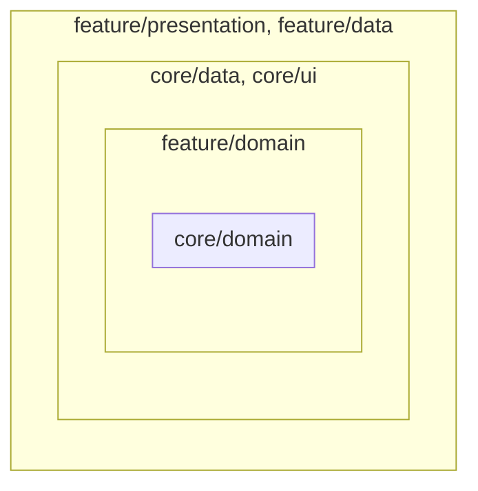
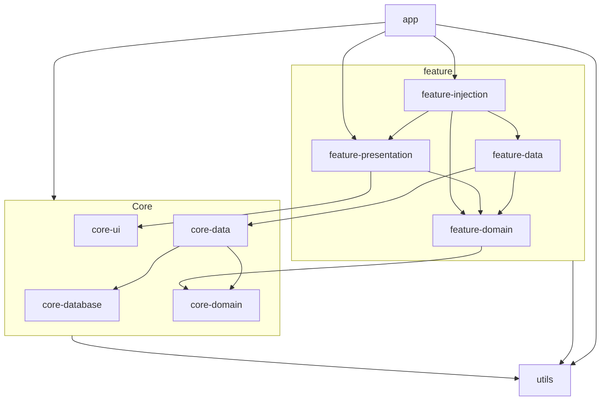

<table>
  <tr>
    <td><h1>FilmCan</h1></td>
    <td></td>
  </tr>
</table>

A modern Android application following a clean architecture approach with a structured multimodule
organization. This project provides a solid foundation for building scalable and maintainable
Android applications.

Meaning of project name: https://en.wikipedia.org/wiki/Film_can

https://github.com/user-attachments/assets/7051be9f-eea3-448f-933e-7dc669888991

## Table of Contents

- [Architecture Overview](#architecture-overview)
- [Module Structure](#module-structure)
- [Custom Gradle Tasks](#custom-gradle-tasks)
- [Build Logic](#build-logic)
- [Dependency Management](#dependency-management)
- [Network Layer](#network-layer)
- [Getting Started](#getting-started)
  - [Demo Variant](#demo-variant)

## Architecture Overview

This project implements a clean architecture approach with a multimodule structure organized by
features. The application is divided into the following main module types:

- **App**: The main application module that connects all the features
- **Core**: Contains shared functionality across features
- **Feature**: Feature-specific modules divided into data, domain, and presentation layers





## Module Structure

### Core Modules

Core modules contain functionality shared across multiple features:

- **core:data**: Network, database access, and common data utilities
- **core:database**: Database setup, DAOs, and entities
- **core:domain**: Common domain
- **core:ui**: Common UI components, themes, and navigation utilities

### Feature Modules

Each feature is isolated in its own module group with four sub-modules:

- **feature:[feature-name]:data**: Implements repositories, network services, and data sources
- **feature:[feature-name]:domain**: Contains business logic, repository interfaces use cases
- **feature:[feature-name]:presentation**: UI components, ViewModels, and UI states
- **feature:[feature-name]:injection**: Dependency injection configs for data, domain and presentation modules

### Libraries Module

A simple module that (I look for a better name) contains common utility classes and doesn't use additional dependencies

### Module Dependency

Presentation and data modules depend on domain modules. core.data module also depends on database.

## Custom Gradle Tasks

The project includes custom Gradle tasks to automate the creation of new modules.

### Creating a Core Module

To create a new core module, run:

```bash
./gradlew createCoreModule -PmoduleName=yourmodulename
```

This task:

- Creates a new core module with the specified name
- Sets up the necessary directory structure
- Creates a basic build.gradle.kts file
- Updates settings.gradle.kts to include the new module

If no module name is specified, it defaults to "newmodule":

```bash
./gradlew createCoreModule
```

### Creating a Feature Module

To create a new feature module with data, domain, and presentation layers, run:

```bash
./gradlew createFeatureModule -PfeatureName=yourfeaturename
```

This task:

- Creates a new feature module with data, domain, presentation and injection sub-modules
- Sets up the necessary directory structure for each sub-module
- Creates build.gradle.kts files with appropriate dependencies
- Updates settings.gradle.kts to include all the new modules

If no feature name is specified, it defaults to "newfeature":

```bash
./gradlew createFeatureModule
```

## Build Logic

The project uses build-logic to share common build configurations across modules.

### [BaseLibraryConventionPlugin.kt](build-logic/convention/src/main/kotlin/buildlogic/BaseLibraryConventionPlugin.kt)

This plugin configures basic Android library modules:

```kotlin
plugins {
    id("base-library")
}
```

### [BasePresentationConventionPlugin.kt](build-logic/convention/src/main/kotlin/buildlogic/BasePresentationConventionPlugin.kt)

```kotlin
plugins {
    id("base-presentation")
}
```

### [BaseDataConventionPlugin.kt](build-logic/convention/src/main/kotlin/buildlogic/BaseDataConventionPlugin.kt)

```kotlin
plugins {
    id("base-data")
}
```

### [BaseDomainConventionPlugin.kt](build-logic/convention/src/main/kotlin/buildlogic/BaseDomainConventionPlugin.kt)

```kotlin
plugins {
    id("base-domain")
}
```

## Dependency Management

Dependency management is centralized in the buildSrc directory using Kotlin DSL.

### Structure

- **ProjectConfigs.kt**: Contains project-level configurations (SDK versions, app ID, etc.)
- **DependencyGroups.kt**: Organizes dependencies into logical groups
- **ProjectExt.kt**: Extension functions for dependency declarations

### Library Versions

Dependencies are declared in the [gradle/libs.versions.toml](./gradle/libs.versions.toml) file,
which maintains a centralized list of library versions. This ensures consistent versions across all
modules and makes updates easier.

### Dependency Groups

The project defines dependency groups that can be applied together:

```kotlin
// Apply all base dependencies
dependencies {
    baseDependencies()
}

// Apply Android-specific dependencies
dependencies {
    baseAndroidDependencies()
}

// Apply Compose-related dependencies
dependencies {
    composeDependencies()
}
//etc....
```

## Network Layer

### ResultCallAdapterFactory

The project includes a custom Retrofit CallAdapter that transforms API responses into a
`Result<T, Failure>` type using the kotlin-result library. This provides a cleaner way to handle
network responses and errors.

#### How It Works

1. **ResultCallAdapterFactory**: Creates a custom CallAdapter for Retrofit that handles API
   responses.
3. **ResultCall**: Custom Call implementation that transforms responses into Result.

The adapter handles different types of errors:

- HTTP error codes (4xx, 5xx)
- Network failures
- SSL errors
- Parsing errors

Each error is transformed into a user-friendly message using
the [StringResource](./utils/src/main/kotlin/utils/StringResource.kt).

#### Creating and Using a Service

NetworkResult is a typealias Result<T, Failure>

1. Define your API service interface:

```kotlin
interface MyService {
    @GET("endpoint")
    suspend fun getData(): NetworkResult<ResponseDto>
}
```

2. Create the service instance using Retrofit with
   the [ResultCallAdapterFactory](core/data/src/main/java/core/data/network/ResultCallAdapterFactory.kt) (
   typically in a Hilt module):

```kotlin
@Provides
fun provideMyService(retrofit: Retrofit): MyService {
    return retrofit.create(MyService::class.java)
}
```

3. Use the service in your repository:

```kotlin
class MyRepositoryImpl(
    private val service: MyService
) : MyRepository {
    override suspend fun getData(): Result<DomainModel, Failure> {
        return service.getData().map {
            it.toDomainModel()
        }
    }
}
```

## Getting Started

### Prerequisites
- API key for TMDB (The Movie Database) set as an environment variable:
  ```
  API_KEY_TMDB=your_api_key
  ```

### Demo Variant

The app includes a `demo` build variant for people who want to try the project from the public
repository.

The demo variant has been created to avoid Firebase setup friction. Firebase Remote
Config and others are abstracted per variant so contributors and reviewers can run the demo build without
having to configure a Firebase project first.
